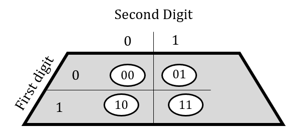
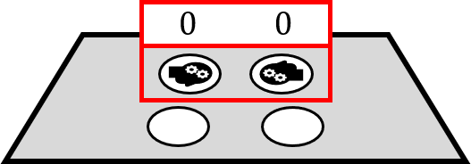
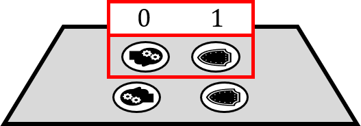
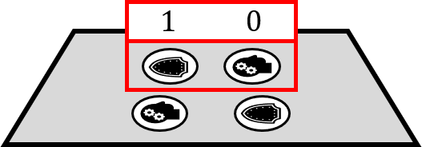
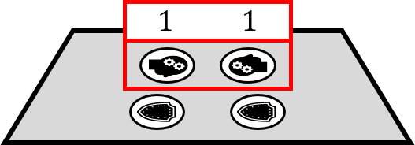
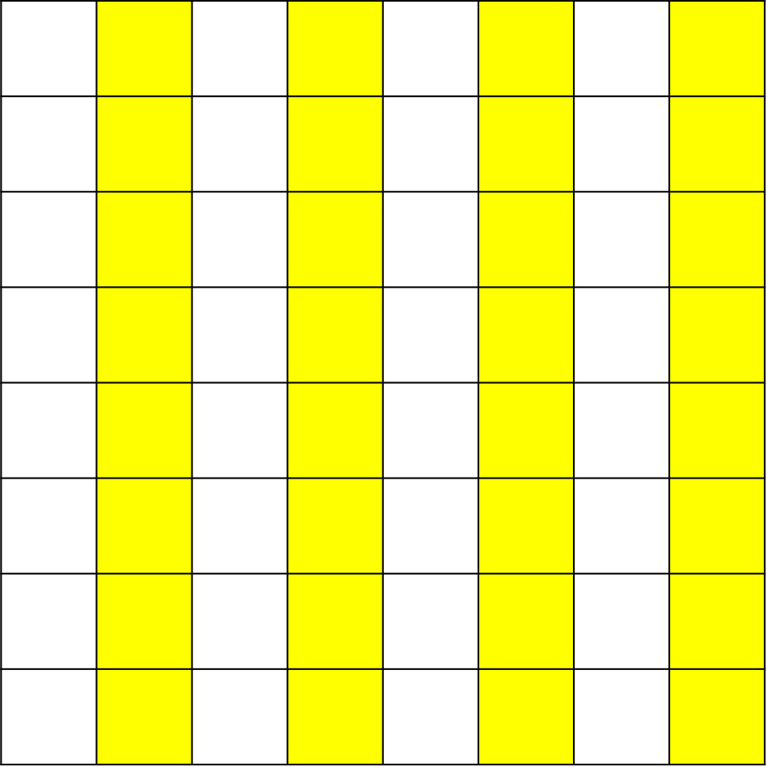
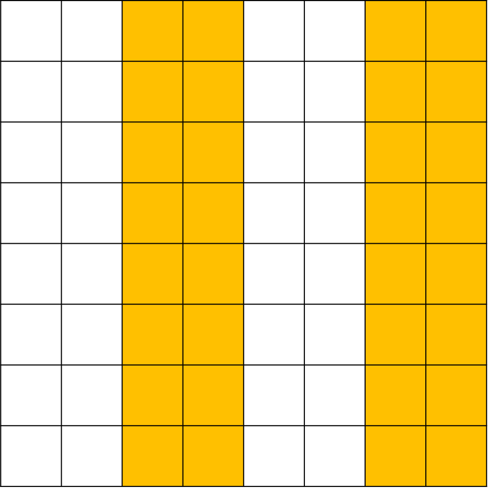
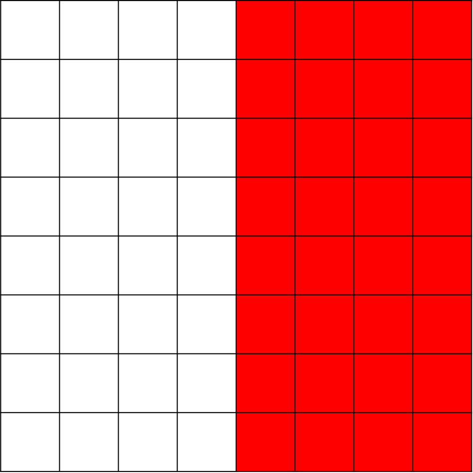
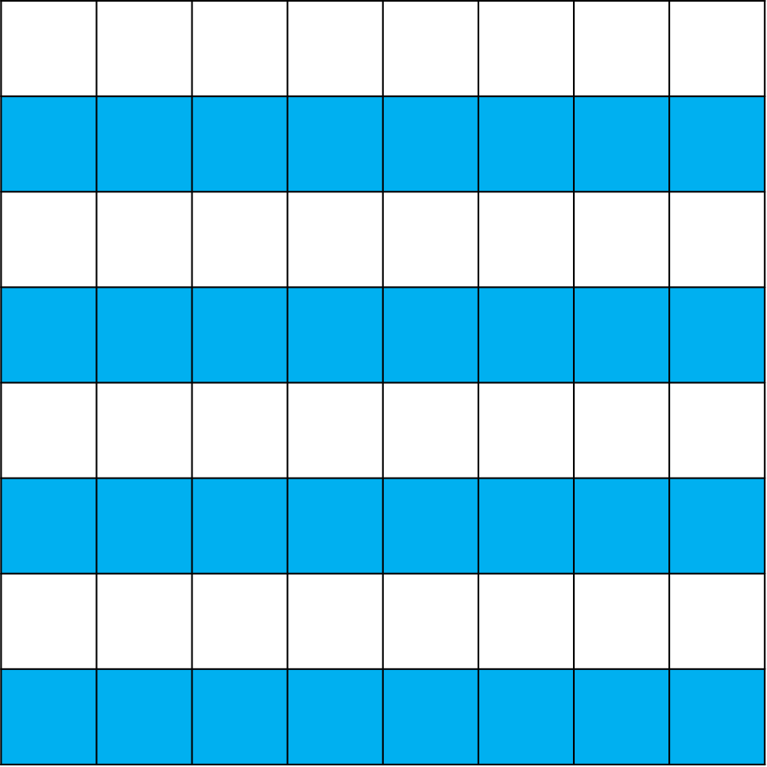
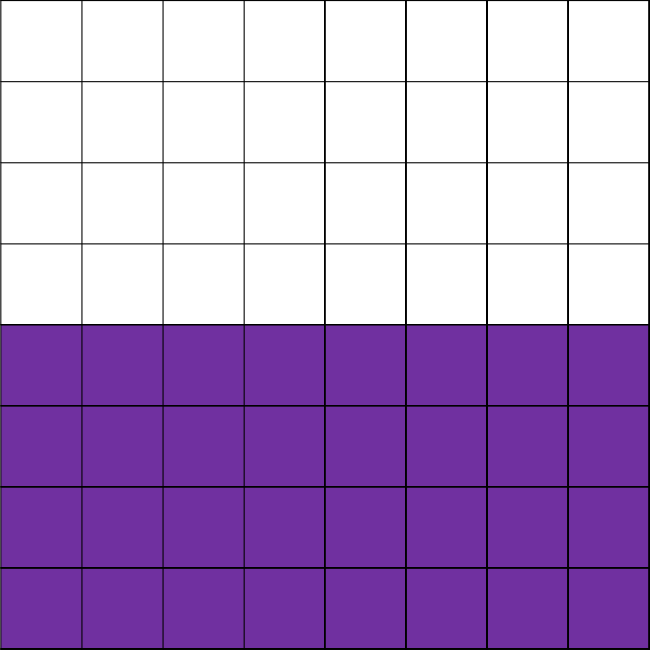

# Bulgarian Solitaire

## Introduction

This is a particularly tricky problem and students will likely require some guidance. The difficulty often comes with seeing where to begin; the puzzle may not even seem possible initally because, since the cell mate cannot know the inital arrangement of the coins, logically there is no way for them to infer which coin you flipped and so it seems that communicating any information to them would therefore be impossible. In the solution section, you will hopefully see how you might develop a solution for this problem. You might be suprised to hear that this game is actually solvable with many more coins in play, have a look at the extension section for more detail.

## Solution

Often the first instinct of students is to devise some system where attempt to make the indicated coin the "odd one out", for example trying to make it the only head or the only tails. This quickly runs into problems so students might try to vary their system based on the inital set up, saying "if there is only one head then we do this but if there are two heads then we do this". This also runs into issues becuase the cell mate is unaware of the inital state of the coins. Unfortunately this thinking leads to a dead end because the focus is on using one coin in particular (often the indicated one) to convey information when, in reality, we are going to need use all 4 of the coins to give information to out cell mate. This is logical, why wouldn't we use all of the coins avaiable to us to get as much scope for communication as possible? 

Once we have changed to this line of thinking, the first step to solving this problem is to think about is the medium by which we are transfering information, namely coins. And what is the significant thing about coins? It is that they can only be in one of two states, either heads or tails. Now you should ask yourself, what does a system in which pieces of information exist in one of two states remind you of? 

If you said computers or a circuit or any *binary system*, then you have uncovered the key to this problem. The trick is that we are going to have to represent the information that we want to convey in binary, using heads and tails instead of 1s and 0s but serving the same purpose.

The next important thing to work out is how much information we are going to need to communicate. Since the indicated coin could be in any of the positions in square, we need to be able to communicate any of 4 possible cases: top-left, top-right, bottom-left and bottom-right. However we already said that we want to use binary to transfer information so it makes sense to associate each position with a binary number.

We could do this as follows:

Where the first digit describes the row of the indicated coin (0 for the top and 1 for the bottom) and the second digit tells us the column (0 for left and 1 for right).

So we have managed to devise a system where we only need to pass on two digits, either 0 or 1, to our cell mate. This is great progress, there are plenty of ways which we could read a two digit binary number from our four coins. For example, we could agree that heads are going to represent a 0 and tails a 1. Then, our cell mate could "read" the top two coins from left to right to get a binary number which they could associate with a position. In fact, this is very close to a solution and would work in most cases.

Let's imagine the inital set up of coins is like this:

If the top-left coin is indicated, this is already what our cell mate is going to read. So we can flip either of the bottom two coins and our set up works.

If the top-right coin is indicated, we can flip the top-right coin to tails to change the number which our cell mate will read to 01.

Similarly, if the bottom-left coin is indicated, we can flip the top-left coin to tails to change the number to 10.

But what if the bottom-right coin is indicated? Since we can't change both of the top coins to tails we are going to need to find another way to change the *meaning* of the top coins to 11. This could be achieved by swapping what digits the heads and tails each represent, if our cell mate reads heads as a 1 then we don't need to change either of the top coins and we have a set up which reads 11.

So, instead of having a pre-arranged meaning of heads and tails, we need to find a way to tell our cell mate which to read as 0s and 1s within the coins themselves. But remember, when the top-left coin was indicated we could have flipped either of the bottom coins so we actually have a spare coin which we aren't currently using! We could use this coin, let's say the bottom-left, to indicate which side should be read as a 0. Let's consider how this works with the same set up as before:

- If the top-left coin is indicated, we flip the bottom-right coin which doesn't change how the system is read.  
- If the top-right coin is indicated, we can flip the top-right coin as before.
- If the bottom-left coin is indicated, we can flip the top-left coin as before.
- If the bottom-right coin is indecated, we can flip the bottom-left coin so that our cell mate reads heads as 1s.

So we have a system which works! But can we know that it will always work for any given set up? To see this, think about how flipping each coin changes how the system is read.

- Flipping the top-left coin changes just the first digit of the number our cell mate reads.
- FLipping the top-right coin changes just the second digit.
- Flipping the bottom-left coin will change both of the digits.
- Flipping the bottom right coin will not change any of the digits.

So whatever the inital system reads, we can change either one, both or none of the digits to read any of 00, 01, 10, or 11. And this is exactly what we need to do!

There are lots of other ways which you could achieve this but they all share the same core method of having each of the four coins change the first, second, both or neither or the digits. This is why, as we said right at the start, we need to use all four coins to communicate the information to our cell mate.

See if you can come up with other systems for winning this game, now that you know the core principal behind all of them.

## Extension

As mentioned in the introduction, it is possible to play this game and win with more coins. Specifically, the game has a guarenteed winning strategy whenever the number of coins is a square power of 2. So 4 ($$2^2$$) is the smallest number of coins with which you can play, you could also use 16 ($$4^2$$), 64 ($$8^2$$), 256 ($$16^2$$) and so on.

Have a look at this video where the problem is set up using a chess board (with 64 squares):
[The almost impossible chessboard puzzle](https://www.youtube.com/watch?v=as7Gkm7Y7h4)

With all of the numbers of coins above, the method for finding a system is the exact same as with 4 coins. Taking 64 as an example, there are $$2^6$$ coins which could possibly be indicated all of which can be represented by a 6 digit binary number. So the question is can we find a way to generate this number such that we are able to change any number of the digits by flipping exactly one coin?

We might ask how many ways are there to select some number of the six digits which need to be changed:
- There is just 1 way we can select no digits.
- There are 6 ways that we can select one digit.
- There are "6 choose 2" = 15 ways to select two digits.
- There are "6 choose 3" = 20 ways to select three digits.
- There are "6 choose 4" = 15 ways to select four digits.
- There are "6 choose 5" = 6 ways to select five digit.
- There is 1 way we can select six digits.

And if each of these needs to be represented by a unique coin, we would need at least $$1 + 6 + 15 + 20 + 15 + 6 + 1 = 64$$ coins. Conveniently, we have exactly the right amount!

In fact, the reason the number of coins needs to be a square power of 2 is to satisfy this condition that there are enough coins to represent each possible way to select some number of digits to be changed.

Now that we know we have enough coins to theoretically represent every possible change to the 6-digit binary number, we just need to devise a way "read" the system which allows us to change any number of the digits. Here is one nice solution:

We will assign binary numbers to the spaces in the grid sequentially starting at 000000 in the top-left and working across left to right and then down the rows to 111111 in the bottom-right.

To "read" the grid, each digit is going to be associated with a region of the grid. To work out the digit, count the number of heads in the region. If there is an even number of heads then the digit is a 0 and if there are an odd number of heads the digit is a 1.

The regions are as follows.

First digit:

Second digit:

Third digit:

Fourth digit:

Fifth digit:

Sixth digit:

In order to change a digit, you just need to flip a coin that is in that region to change the number of heads by one and so go either from even to odd (0 to 1) or odd to even (1 to 0).

So you would need to first of all work out the number the that the system reads initially, then compare that to the number of the indicated square and work out which digits you need to change. Then find the appropriate sqaure which lies in all of the regions of the digits to be changed and flip that coin. Your cell mate can then come in and read the grid in the same way you did, and this will tell them which square was indicated.
