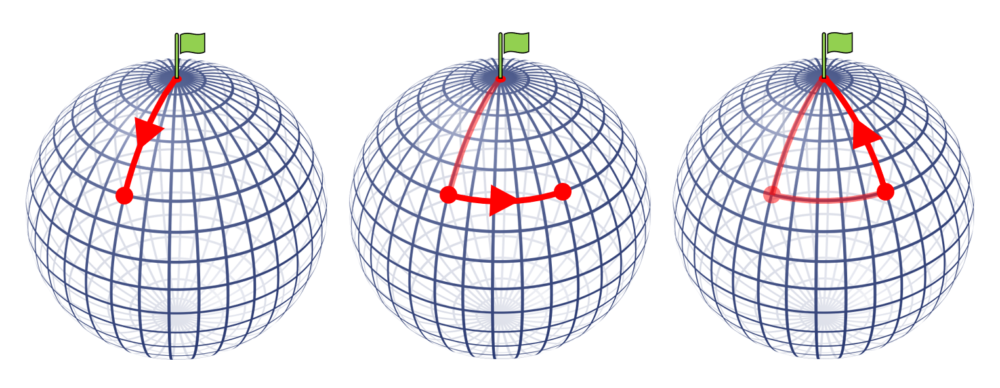

# Where on Earth?

## Introduction

The nice thing about this puzzle is that there are multiple answers which increase in obscurity. Usually students will find one particular answer first (or if they have heard the problem before, this is likely the solution that they will have seen), which is given in the Solution Section. This solution is a great example of how geometry is different on flat and curved surfaces, specifically that the sum of the angles in a triangle is more that 180 degrees on sphere.

In addition to this answer, there are others which are less obvious and students may need to be guided to find these solutions. These are given in the Extension Section.

## Solution

The first solution that students will likely find is that you could begin your journey at the North Pole.

We can see why this situation works by thinking carefully about how moving either north/south or east/west works. When travelling north or south, we are moving towards or away from the north pole so our distance from the north pole changes. Whereas when travelling east or west, we move perpendicular to this and so the distnace from the north pole does not change.

So, starting at the north pole, travelling 1km south ends 1km away from the north pole.  
Moving 1km east does not change the distance away from the pole, leaving us still 1km away.  
Finally, travelling 1km north, towards the north pole, brings the journey back to its starting point.

It may be more obvious to see this with a diagram:

## Extension
