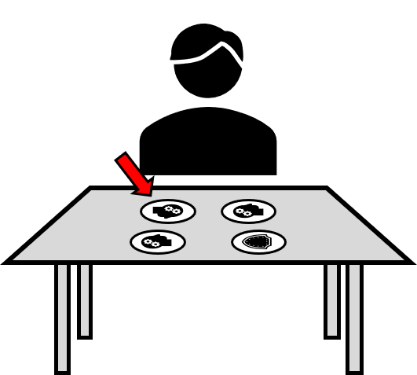

# The Prisoners Problem

You are a prisoner. However, you and your cell mate have been offered your freedom by the guard on the condition that you can win his game.

The game goes as follows:

- Your cell mate will leave the room and then the guard will place 4 coins in a square in front of you. Each coin will be randomly heads or tails and there is no way for your cell mate to know the inital state of any of the coins (since they are not in the room).  
- The guard will then indicate one of the coins. At this point, you must flip over exactly one of the coins in front of you. You will then be lead out of the room.  
- Next, your cell mate will enter the room and stand in the position that you were standing (so that the orientation of the square of coins in the same). In order to win your freedom, they must tell the guard which coin was initially indicated to.

For an example, you could encounter a situation like this:

You would then be allowed to turn any of the three heads to tails, or turn the tail coin to a head. You cell mate would then have to indicate the top-left coin in order to win.

There is no way for you and your cell mate to communicate once they leave the room, all you are allowed to do is turn over one coin.

The guard gives you time to plan a strategy.

Can you think of a way to guarentee your freedom?
